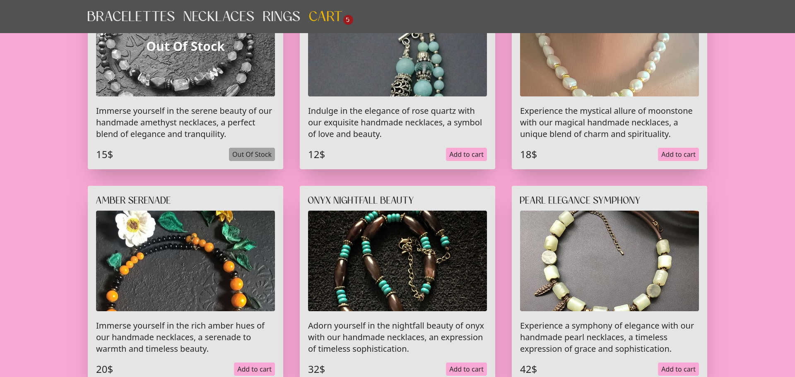

# Accesories Store Mockup

Responsive application. Using Vite, TailwindCss. Also gh-pages used to host the mockup:
[Demo](https://github.com/lookatthisdoode/accesories-store-vite)


## Installation

Fork this repo, then run:

````bash
npm install
````


## Usage

Start developing server by running:

```bash
npm run dev
````
