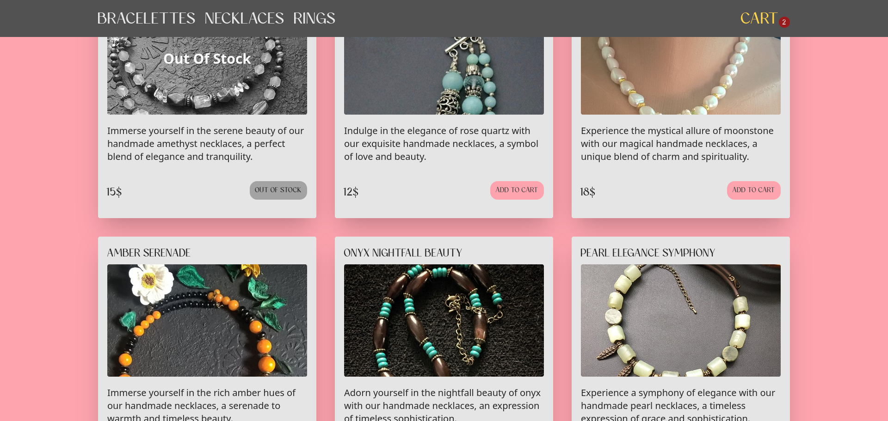

# Accessories Store Mockup


[Live Preview](https://lookatthisdoode.github.io/accesories-store-vite)

## Overview

Welcome to the Accessories Store Mockup, a full-stack application built with js, Vite, TailwindCSS, and MongoDB. This project provides a responsive and stylish interface for browsing and purchasing accessories.

## Features

- **Vite:** Utilizes Vite for developing fast, efficient and maintainable components.
- **Responsive Design:** Crafted with TailwindCSS to ensure a seamless experience across various devices.
- **Functional Cart:** Allows users to add and remove items from the cart, with state persistence using local storage.
- **API Server:** The project includes a functional API server hosted on Heroku, providing product data and enabling order storage to MongoDB.
- **MongoDB Integration:** Products and orders data are stored and retrieved from MongoDB, offering a robust and scalable solution.

## API Server Repository

For more details on the API server and how it handles data, please check the
[Accessories Store API repository](https://github.com/lookatthisdoode/accesories-store-api)

Feel free to explore, contribute, and enhance this Accessories Store Mockup for your own projects!

## Installation

To get started, fork this repository, and then run the following commands:

```bash
npm install

```

### Running the Application

Start the development server:

```bash
npm run dev
```

Open your browser and navigate to the link from console to view the live preview.
